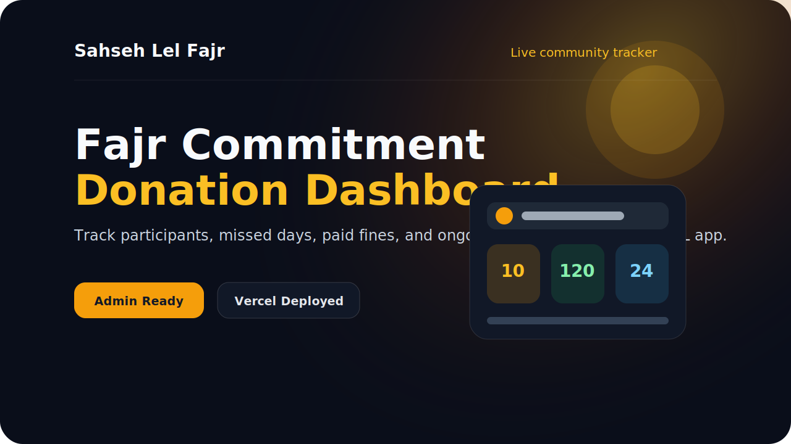
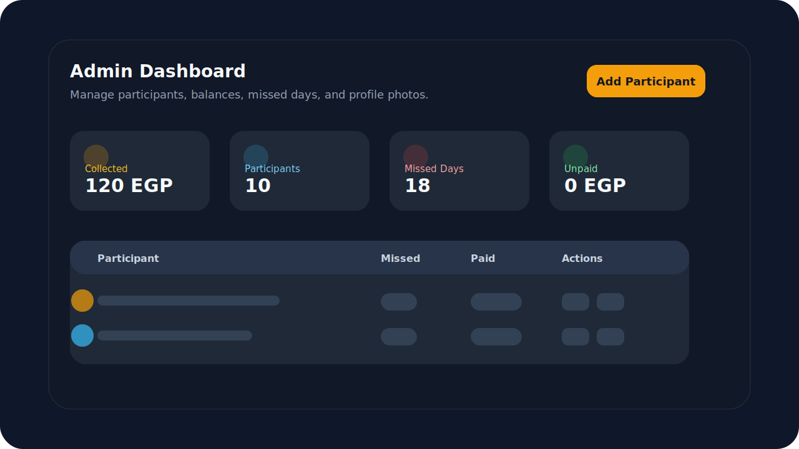
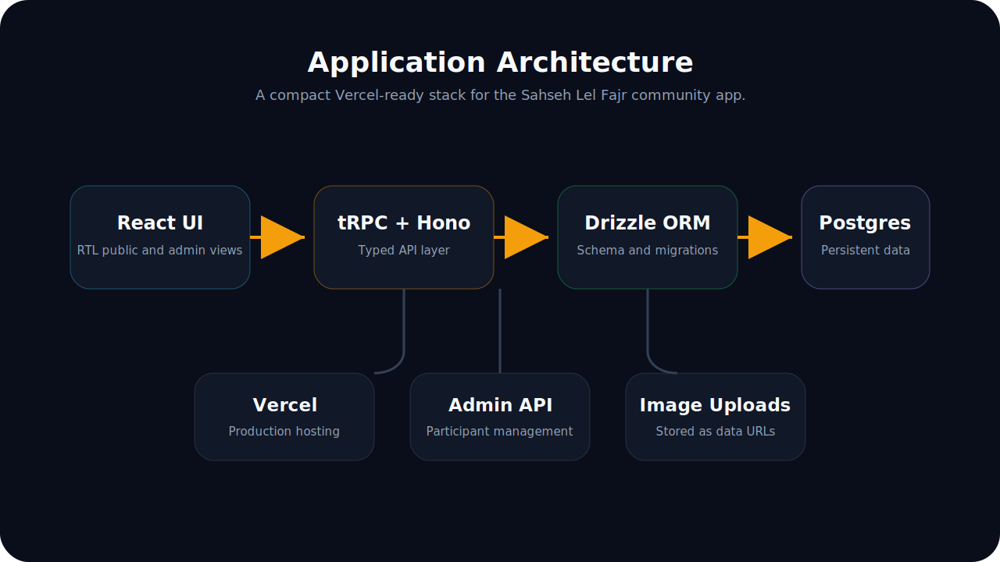

<p align="center">
  
</p>

# Sahseh Lel Fajr

Sahseh Lel Fajr is a private Arabic web app for tracking a small community's Fajr prayer commitment, missed-day fines, collected donations, and participant records. It includes a public participant view and a protected admin dashboard for maintaining participant data.

[Live production app](https://fajr-zeta.vercel.app)

<p align="center">
  
</p>

## Preview

<p align="center">
  
  
</p>

## Features

- Arabic RTL interface with responsive public and admin views.
- Participant cards with photos, missed counts, paid amounts, and unpaid amounts.
- Protected admin login for participant management.
- Add, edit, and delete participants from the dashboard.
- Upload participant photos directly from the admin's device.
- PostgreSQL persistence with Drizzle ORM migrations.
- Vercel-ready API routes and production deployment configuration.

## Tech Stack

- React 19
- TypeScript
- Vite
- Tailwind CSS
- shadcn/ui primitives
- tRPC
- Hono
- Drizzle ORM
- PostgreSQL
- Vercel

## Project Structure

```text
api/                 Vercel API entrypoint
db/                  Drizzle schema, relations, seed, and migrations
server/              Hono/tRPC server code
src/components/      Shared UI components
src/pages/           Application pages
src/sections/        Home page sections
public/assets/       Public images and branding
```

## Getting Started

Install dependencies:

```bash
npm install
```

Create a local environment file:

```bash
cp .env.example .env
```

Set `DATABASE_URL` in `.env`, then apply migrations:

```bash
npm run db:migrate
```

Run the development server:

```bash
npm run dev
```

Build for production:

```bash
npm run build
```

Run type checks:

```bash
npm run check
```

## Deployment

The project is configured for Vercel through `vercel.json`.

```bash
vercel deploy --prod
```

Production currently runs at [fajr-zeta.vercel.app](https://fajr-zeta.vercel.app).

## Copyright

Copyright (c) 2026 Mohamed Essam. All rights reserved.

This repository is proprietary. See [LICENSE](LICENSE) for details.
